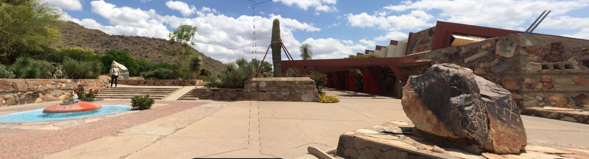
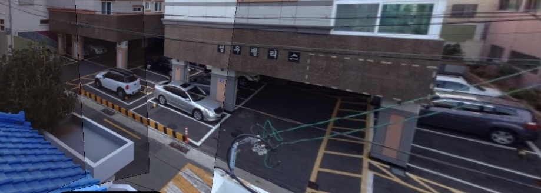
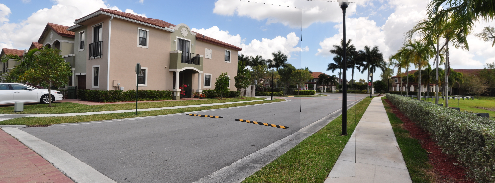
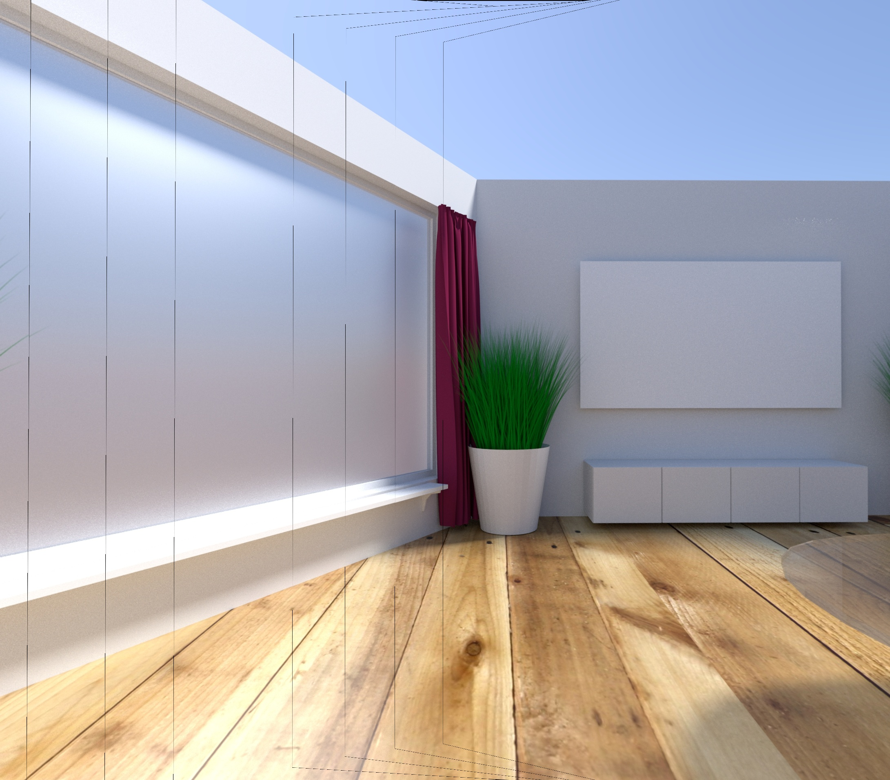
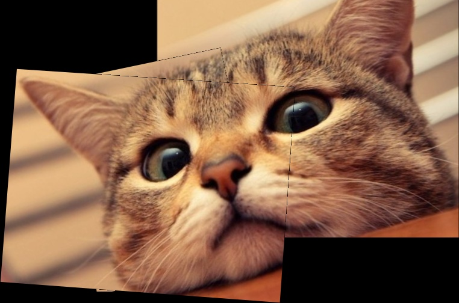

# Panorama - CS231.L11.KHCL


Trần Minh Tiến - 18521492

---

### Introduction:
The project is to implement a image stitching algorithm. It uses multiple images with overlapping areas to create a high-resolution image. Input images must have left to right or right to left order. 
You can use directly my demo here: https://panorama4cat.herokuapp.com

*Due to free hosting, server may not have enough resources to perform more than 5 high-resolution images, so I suggest using local to run this.

### Installation:

```sh
$ (env)
$ pip install -r requirements.txt
```

### Usage:

Web app using flask as backend, I use default port:

```sh
http://127.0.0.1:5000/
```

To run web app, use this:
```sh
$ python app.py
```

To run directly from terminal, use this:
```sh
$ python main.py <images_path_dir> <output_path_dir>
```

### Results:
* All the images output in folder "demo"
* Test images data in folder "images"
* Video demo here: https://youtu.be/2ly2rT_pU4w


Demo1:



Demo2:



Demo3:



Demo4:



Demo5 without cropping:




### References:
[1] M. Brown and D. G. Lowe, “Automatic Panoramic Image Stitching using Invariant Features,”

[2] https://www.pyimagesearch.com/2018/12/17/image-stitching-with-opencv-and-python/

[3] https://mono.software/2018/03/14/Image-stitching/

[4] https://viblo.asia/p/image-stitching-thuat-toan-dang-sau-cong-nghe-anh-panorama-LzD5dee4KjY

[5] https://opencv-python-tutroals.readthedocs.io/en/latest/py_tutorials/py_feature2d/py_matcher/py_matcher.html

[6] "PASSTA Datasets", http://www.cvl.isy.liu.se/en/research/datasets/passta/
